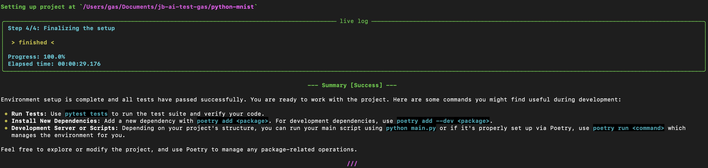
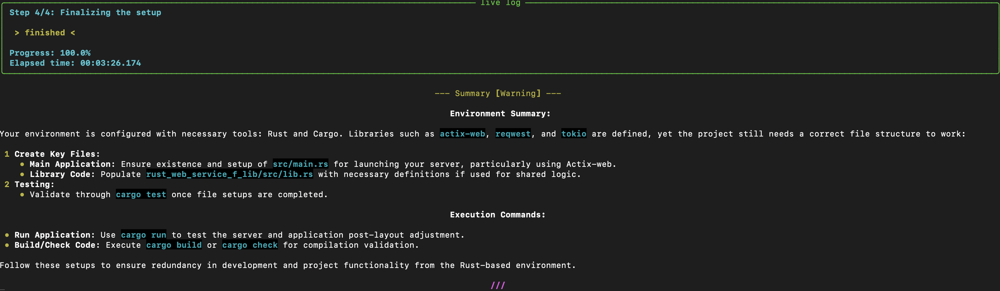

# Env-Setuper  

Cli tool for automatic environment setup using LLM.  

## Configure  

For mac os, install `coreutils` package:  
```sh
brew install coreutils
```

Install [python build deps](https://github.com/pyenv/pyenv/wiki#suggested-build-environment).  
Install [pyenv](ihttps://github.com/pyenv/pyenv?tab=readme-ov-file#installation).  
Get `python3.12`:  
```sh
pyenv install 3.12
```  

Finally, install [poetry](https://python-poetry.org/docs/):  
```sh
curl -sSL https://install.python-poetry.org | python3 -
```  

Then you can run `make install` in order to install all project's deps.  

## Install as a package  

First, build the wheel:
```sh
make build
```  
Then, install it globally, using either `pip`:  
```sh
pip install dist/env_setuper-0.1.0-py3-none-any.whl
```
Or poetry:  
```sh
[tool.poetry.dependencies]
env-setuper = { path = "dist/env_setuper-0.1.0-py3-none-any.whl" }
```  

## Usage  

If installed as a global package, you can use it as a cli tool:  
```sh
env-setuper /path/to/project
```  

Explore [cli.py](./env_setuper/cli.py) for available arguments.  
Here are the most important ones:  
  * `--restricted-shell/--no-restricted-shell` - by default, shell session runs in a [restricted mode](https://www.gnu.org/software/bash/manual/html_node/The-Restricted-Shell.html), meaning it can't really harm your system. You can use non-srestricted mode, when you're sure you have good isolation;    
  * `--max-agent-iter` - max amount of iteration allowed for a single assistant run, default is 30;    
  * `--max-agent-fails` - max amount of non-complete statuses per assistant call, default is `None` so it euqals to overall mac iterations;  

Othewise, after `make install`, you can always call it like that:  
```sh
poetry run env-setuper /path/to/project
```  

_Hint_: if you see issues related to openai - try to provide api key explicitely right in the shell command, like:
```sh
OPENAI_API_KEY=$OPENAI_API_KEY poetry run ...
```
or 
```sh
OPENAI_API_KEY=$OPENAI_API_KEY env-setuper ...
```  

If you're brave, you can try to run the tool with non-restricted shell (do it on __your own risk__):  
```sh
env-setuper /path/to/project --no-restricted-shell
```  

Also, you may want to change iteration limit:  
```sh
env-setuper /path/to/project --max-agent-iter 50
```

The success looks like the following:  



If any issues occured, you'll see smth like this:  



## Implementation details  

### Concept description

So, I've tried to keep just a plain project structure with several files in it (with self-descriptive names). You can find everything you need in the [env_setuper](./env_setuper/) folder.  
My __initial__ idea was to orginize the workflow in a multiple steps:
  - Identifying tech stack: getting details about the languages, build systems, etc.  
  - Installing system-level dependencies: checking and installing interpreters, compilers, build systems.  
  - Installing project dependencies: installing project depedencies, like libraries; evaluating the correctness.  
  - Finalizing the setup: generating the summary of what's done and giving action points.  
Each of these steps is a separate system prompt, with a loop, where the output of the current iteration is added to the input of the next.  
The output of each LLM query, could be either the status of the operation and a summary of what's done, or a tool call.  
__But__, after some tests I've figured out that it's actually enough just a single step with prompt, that combines tasks I've showed above.  
So I left a single big `SETUP_PROMPT`, and the workflow reduced to just a single task.
The only tool I use here - is a "terminal tool". It's a shell running in a subprocess, and waiting for the commands generated by LLM.  
The loop is restricted in the max. amount of iterations it could run, to not stuck.  

### Known issues  

  - tool can stuck on some command execution. It could be installing dependencies. So either wait or terminate, if it takes too long. It could be just really slow internet or issues with running certain terminal commands. The other funny issue - if it runs web server and never closes, since no text feedback available from the shell.  
  - sometimes shell could freeze bc of some complex commands being executed in a shell - it's connected to buffering, that Im trying to disable with `stdbuf`, but there are a lot of edge-cases that are not covered, and should be a part of shell commands evaluation in a terminal class;  
  - some commands can't be run even in non-restricted mode, and with all permissions (tested in docker). Most probably - it's, again, shell in subprocess. Propper implenetation of it can solve most of the issues;  
  - some commands results can't be decoded with utf-8 for some reason, and can cause a run-time error. Most probably it's smth simple that I've missed, but still the issue exists, and it's hard to reproduce;  

### Thinkgs to improve  

  - add propper tests;  
  - create `.env` file, with all newly added env vars. It didn't work properly for me, but it could be done in a nice way, to avoid modifying the central env but still make env. setup reproducible;  
  - refactor lot of hacky code, especially regarding logging and terminal usage;
  - add abstraction for LLM - now its only for openai client (which most probably would be enough for now, tbh);  
  - had a lot of problems with shell commands output buffering, the current solution is hacky, and can still cause shell freezing;  
  - improving prompts - it still could be suboptimal, especially it lacks control on which shell commands should be generated, it could be beneficial to make more fine-grained control on that, to minimize errors and achieve a goal in less iterations;  
  - timer is being updated only on next log message appearance, so don't be afraid when you it stuck - it's just a current operation execution could take some time to complete;  
